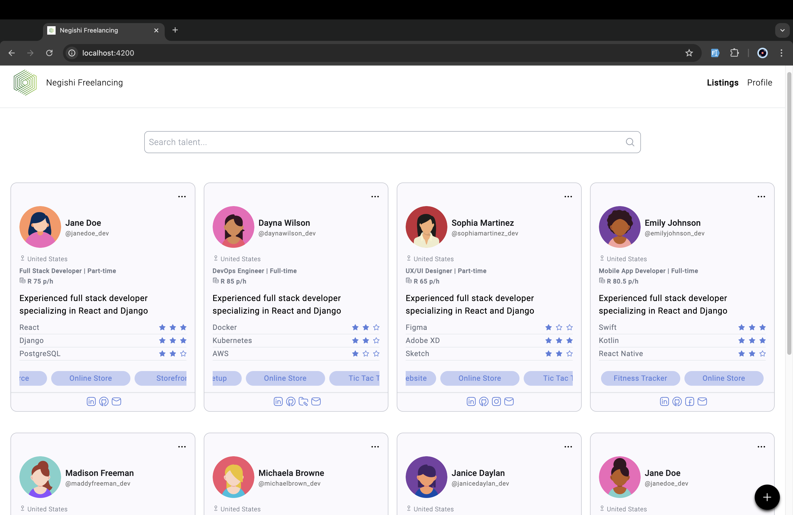
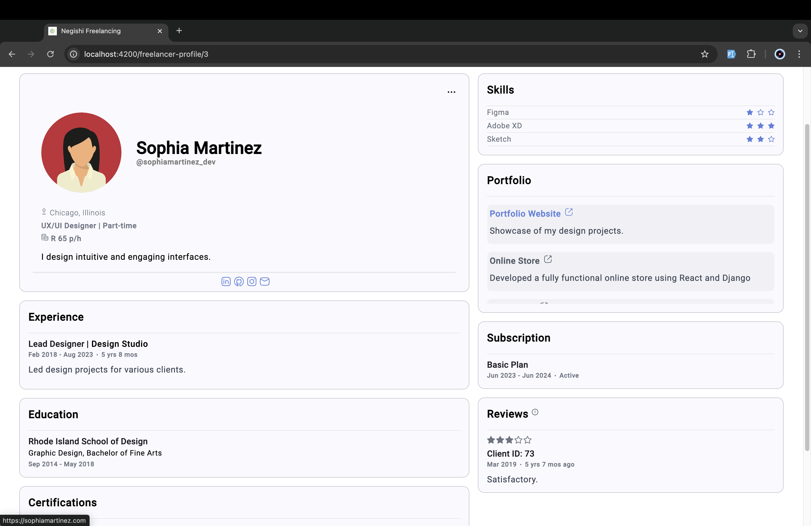
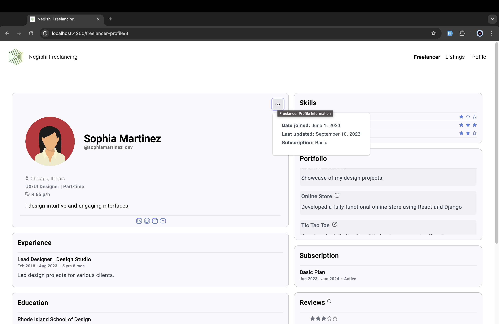
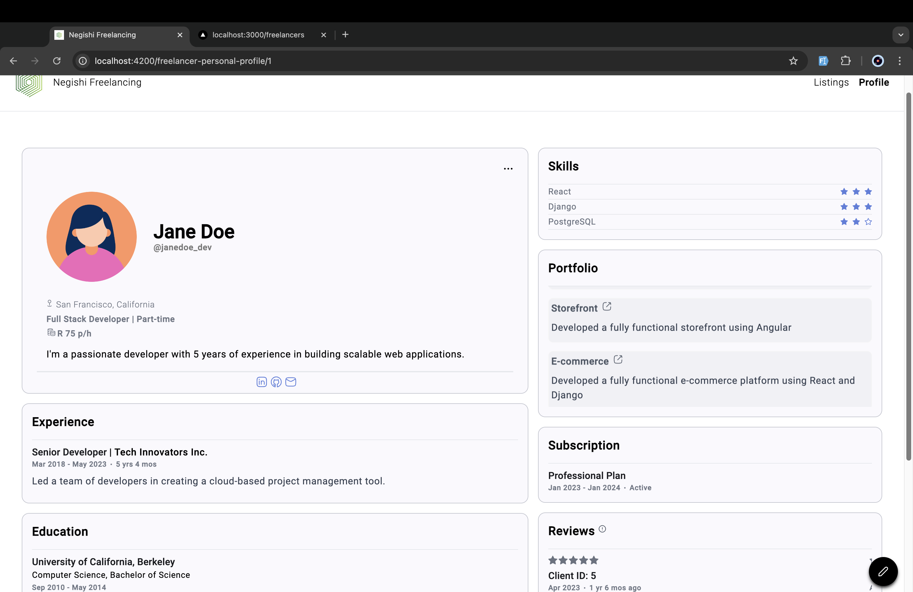
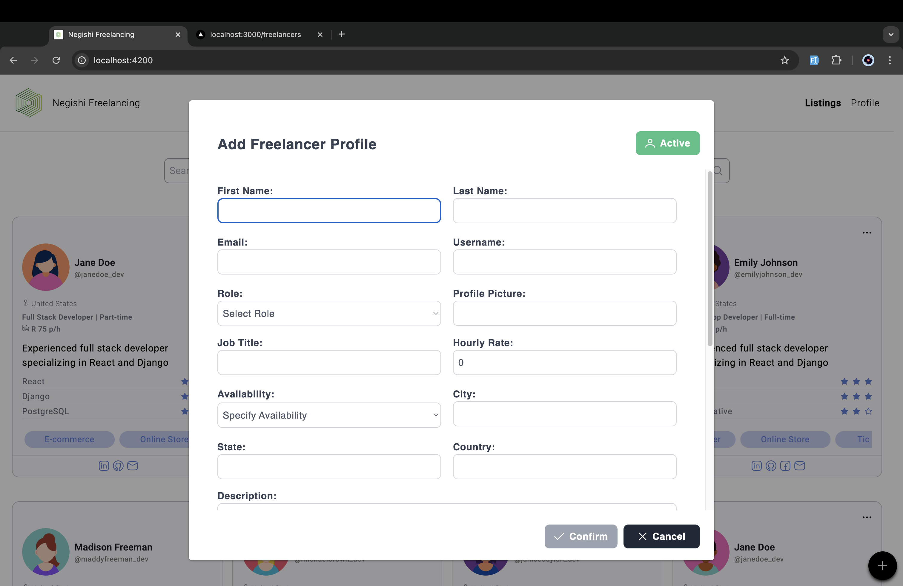
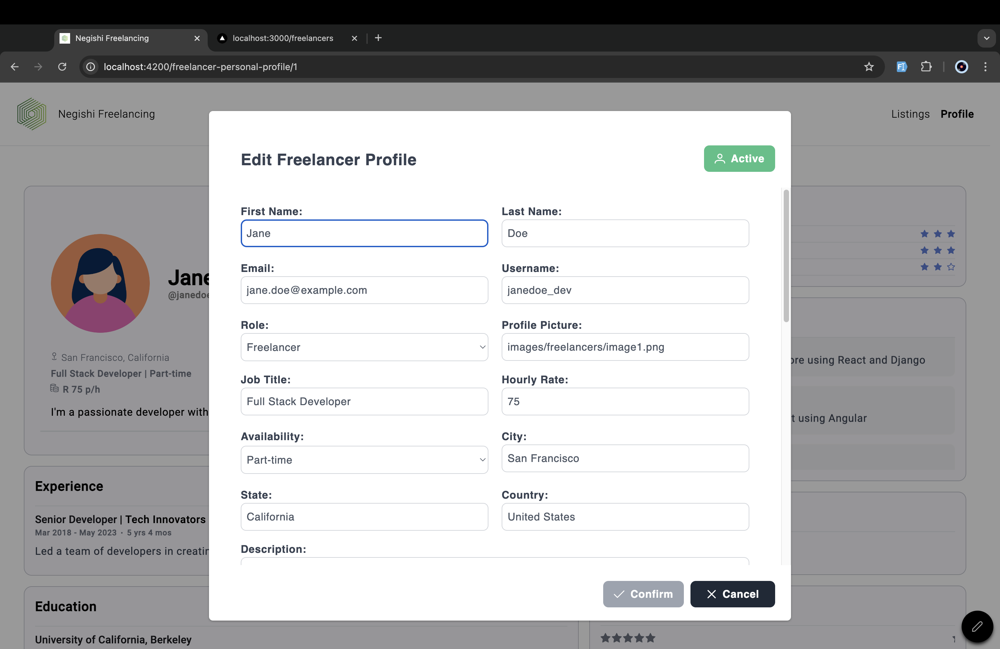
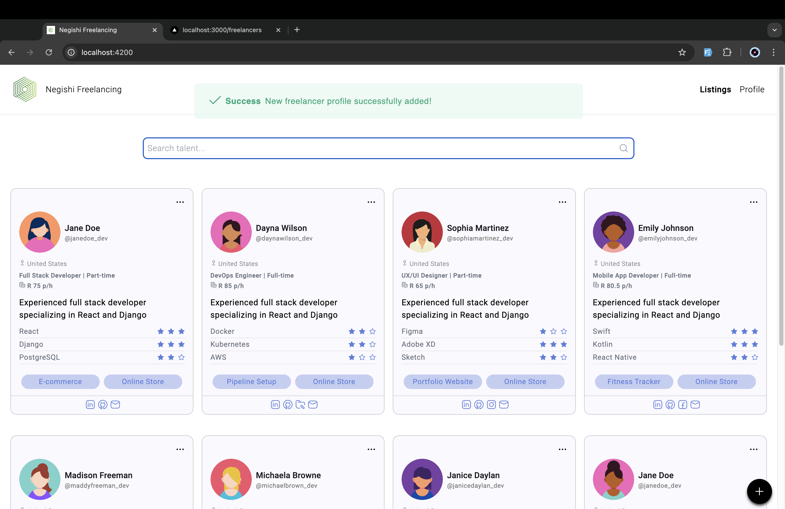
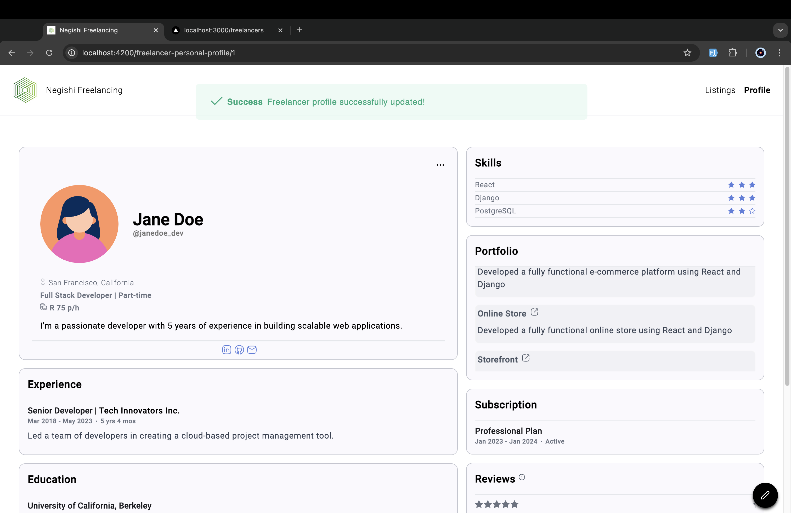
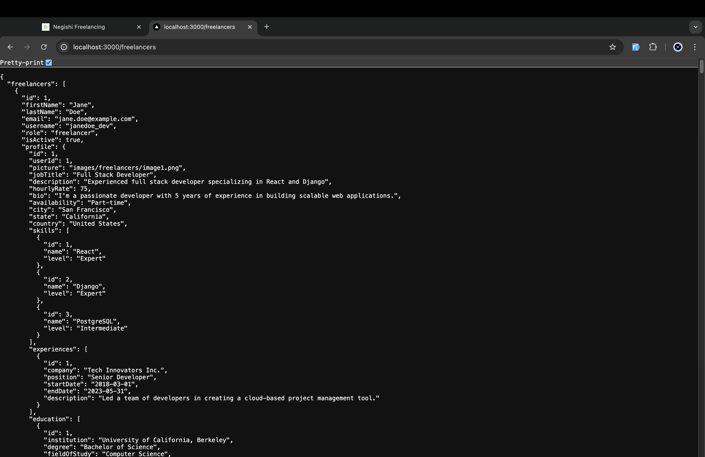

# Freelancer Profile Manager - Full Stack Application

The **Freelancer Profile Manager** application features a **frontend** built with **Angular** and a **backend** powered by **Node.js** with **Express.js** layered on top. Users can perform full CRUD (Create, Read, Update, Delete) operations on freelancer profiles, showcasing various professionals and their talent and skills.

## Note

To access the application's freelancer edit and addition functionalities on your local machine, follow the instructions from [here](#frontend) below. Note that the Vercel deployment offers a read-only file system for serverless functions.

## Table of Contents

- [Freelancer Profile Manager - Full Stack Application](#freelancer-profile-manager---full-stack-application)
  - [Note](#note)
  - [Table of Contents](#table-of-contents)
  - [Overview](#overview)
  - [Entity Relationship Diagram](#entity-relationship-diagram)
  - [Features](#features)
  - [Screenshots](#screenshots)
  - [Frontend](#frontend)
    - [Frontend: Prerequisites](#frontend-prerequisites)
    - [Frontend: Installation](#frontend-installation)
    - [Frontend: Usage](#frontend-usage)
  - [Backend](#backend)
    - [Backend: Prerequisites](#backend-prerequisites)
    - [Backend: Installation](#backend-installation)
    - [Backend: Usage](#backend-usage)
  - [Backend: JSON Structure](#backend-json-structure)
  - [Configuration](#configuration)

## Overview

The application allows users to browse, add, update and delete freelancer profiles, ensuring smooth management through seamless interaction between the frontend and backend.

## Entity Relationship Diagram


## Features

- **Frontend:**

  - Angular application with routing and services
  - CRUD operations for freelancer profile management
  - Customised profile images

- **Backend:**
  - Express.js server with RESTful API
  - JSON data storage for simplicity

## Screenshots

Here are some screenshots of the project in action:

- **Freelancer Listings:**
  

- **Freelancer Selected Viewing Profile:**
  

- **Profile Information & Accessibility:**
  

- **Freelancer Personal Profile Page:**
  

- **Add Profile Popup:**
  

- **Update Profile Popup:**
  

- **Add Profile Success:**
  

- **Update Profile Success:**
  

- **Popup Validation:**
  

- **Mock Backend Service:**
  

## Frontend

### Frontend: Prerequisites

- [Node.js](https://nodejs.org/) and [npm](https://www.npmjs.com/)
- Angular CLI:

  ```zsh
  npm install -g @angular/cli
  ```

### Frontend: Installation

1. Clone the repository:

   ```zsh
   git clone https://github.com/jediahjireh/freelancer-profile-manager.git
   ```

2. Navigate to the frontend directory:

   ```zsh
   cd freelancer-profile-manager/frontend
   ```

3. Install dependencies:

   ```zsh
   npm install
   ```

### Frontend: Usage

1. Start the development server:

   ```zsh
   ng serve
   ```

2. Open [http://localhost:4200/](http://localhost:4200/) in your browser.

## Backend

### Backend: Prerequisites

- [Node.js](https://nodejs.org/) and [npm](https://www.npmjs.com/)

### Backend: Installation

1. Clone the repository:

   ```zsh
   git clone https://github.com/jediahjireh/freelancer-profile-manager.git
   ```

2. Navigate to the backend directory:

   ```zsh
   cd freelancer-profile-manager/backend
   ```

3. Install dependencies:

   ```zsh
   npm install
   ```

### Backend: Usage

1. Start the server:

   ```zsh
   npm start
   ```

2. Access the server at [http://localhost:3000/](http://localhost:3000/).

## Backend: JSON Structure

Freelancer data is managed using the JSON structure in [`freelancers.json`](/backend/freelancers.json):

```json
{
  "id": 1,
  "first_name": "Jane",
  "last_name": "Doe",
  "email": "jane.doe@example.com",
  "username": "janedoe_dev",
  "role": "freelancer",
  "is_active": true,
  "profile": {
    "id": 1,
    "user_id": 1,
    "job_title": "Full Stack Developer",
    "description": "Experienced full stack developer specializing in React and Django",
    "hourly_rate": 75.0,
    "bio": "I'm a passionate developer with 5 years of experience in building scalable web applications.",
    "availability": "Part-time",
    "city": "San Francisco",
    "state": "California",
    "country": "United States",
    "skills": [
      {
        "id": 1,
        "name": "React",
        "level": "Expert"
      },
      {
        "id": 2,
        "name": "Django",
        "level": "Expert"
      },
      {
        "id": 3,
        "name": "PostgreSQL",
        "level": "Intermediate"
      }
    ],
    "experiences": [
      {
        "id": 1,
        "company": "Tech Innovators Inc.",
        "position": "Senior Developer",
        "start_date": "2018-03-01",
        "end_date": "2023-05-31",
        "description": "Led a team of developers in creating a cloud-based project management tool."
      }
    ],
    "education": [
      {
        "id": 1,
        "institution": "University of California, Berkeley",
        "degree": "Bachelor of Science",
        "field_of_study": "Computer Science",
        "start_date": "2010-09-01",
        "end_date": "2014-05-31"
      }
    ],
    "certifications": [
      {
        "id": 1,
        "name": "AWS Certified Developer - Associate",
        "issuing_organization": "Amazon Web Services",
        "issue_date": "2022-01-15",
        "expiration_date": "2025-01-15"
      }
    ],
    "portfolio_items": [
      {
        "id": 1,
        "title": "E-commerce Platform",
        "description": "Developed a fully functional e-commerce platform using React and Django",
        "url": "https://github.com/janedoe/ecommerce-platform"
      }
    ],
    "reviews": [
      {
        "id": 1,
        "client_id": 5,
        "rating": 5,
        "comment": "Jane is an excellent developer. She delivered the project on time and exceeded our expectations.",
        "created_at": "2023-04-15T14:30:00Z"
      }
    ],
    "social_links": [
      {
        "id": 1,
        "platform": "LinkedIn",
        "url": "https://www.linkedin.com/in/janedoe"
      },
      {
        "id": 2,
        "platform": "GitHub",
        "url": "https://github.com/janedoe"
      }
    ],
    "created_at": "2023-01-01T00:00:00Z",
    "updated_at": "2023-06-15T12:30:00Z"
  },
  "subscription": {
    "id": 1,
    "plan": "Professional",
    "start_date": "2023-01-01",
    "end_date": "2024-01-01",
    "is_active": true
  }
}
```

Based on template given in [freelancerProfile.json](/docs/freelancerProfile.json)

## Configuration

Replace the live website links with localhost endpoints to run this project locally.

- Backend: [server.js](/backend/server.js) (replace link to frontend):

```javascript
// cors configuration - allow requests from frontend (https://localhost:4200)
const corsOptions = {
  origin: "https://localhost:4200",
  optionsSuccessStatus: 204,
  methods: "GET, POST, PUT, DELETE",
};
```

- Frontend: [freelancers.service.ts](/frontend/src/app/services/freelancers.service.ts) (replace link to backend API)

```typescript
// base URL for the API
private baseUrl: string = 'http://localhost:3000/freelancers';
```

---
