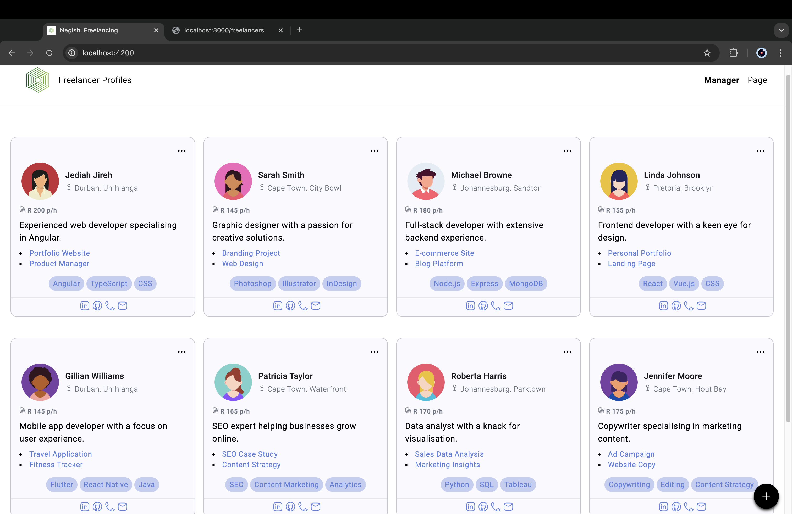
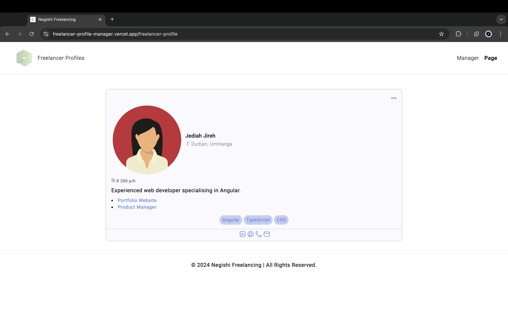

# Freelancer Profile Manager - Full Stack Application

The **Freelancer Profile Manager** application features a **frontend** built with **Angular** and a **backend** powered by **Node.js** with **Express.js** layered on top. Users can perform full CRUD (Create, Read, Update, Delete) operations on freelancer profiles, showcasing various professionals and their talent and skills.

## Note

To access the application's CRUD functionalities on your local machine, follow the instructions from [here](#frontend) below. Note that the Vercel deployment offers a read-only file system for serverless functions.

## Table of Contents

- [Freelancer Profile Manager - Full Stack Application](#freelancer-profile-manager---full-stack-application)
  - [Note](#note)
  - [Table of Contents](#table-of-contents)
  - [Overview](#overview)
  - [Features](#features)
  - [Screenshots](#screenshots)
  - [Frontend](#frontend)
    - [Frontend: Prerequisites](#frontend-prerequisites)
    - [Frontend: Installation](#frontend-installation)
    - [Frontend: Usage](#frontend-usage)
  - [Backend](#backend)
    - [Backend: Prerequisites](#backend-prerequisites)
    - [Backend: Installation](#backend-installation)
    - [Backend: Usage](#backend-usage)
  - [Backend: JSON Structure](#backend-json-structure)
  - [Configuration](#configuration)

## Overview

The application allows users to browse, add, update and delete freelancer profiles, ensuring smooth management through seamless interaction between the frontend and backend.

## Features

- **Frontend:**

  - Angular application with routing and services
  - CRUD operations for freelancer profile management
  - Customised profile images

- **Backend:**
  - Express.js server with RESTful API
  - JSON data storage for simplicity

## Screenshots

Here are some screenshots of the project in action:

- **Freelancer Listings:**
  

- **Search Talent Search Bar:**
  

- **Pagination:**
  

- **Freelancer Profile Page:**
  

- **Add Freelancer:**
  

- **Update Freelancer:**
  

- **Deleted Freelancer:**
  

- **Card Actions & Accessibility:**
  

- **Popup Validation:**
  

- **Mock Backend Service:**
  

## Frontend

### Frontend: Prerequisites

- [Node.js](https://nodejs.org/) and [npm](https://www.npmjs.com/)
- Angular CLI:

  ```zsh
  npm install -g @angular/cli
  ```

### Frontend: Installation

1. Clone the repository:

   ```zsh
   git clone https://github.com/jediahjireh/freelancer-profile-manager.git
   ```

2. Navigate to the frontend directory:

   ```zsh
   cd freelancer-profile-manager/frontend
   ```

3. Install dependencies:

   ```zsh
   npm install
   ```

### Frontend: Usage

1. Start the development server:

   ```zsh
   ng serve
   ```

2. Open [http://localhost:4200/](http://localhost:4200/) in your browser.

## Backend

### Backend: Prerequisites

- [Node.js](https://nodejs.org/) and [npm](https://www.npmjs.com/)

### Backend: Installation

1. Clone the repository:

   ```zsh
   git clone https://github.com/jediahjireh/freelancer-profile-manager.git
   ```

2. Navigate to the backend directory:

   ```zsh
   cd freelancer-profile-manager/backend
   ```

3. Install dependencies:

   ```zsh
   npm install
   ```

### Backend: Usage

1. Start the server:

   ```zsh
   npm start
   ```

2. Access the server at [http://localhost:3000/](http://localhost:3000/).

## Backend: JSON Structure

Freelancer data is managed using the following JSON structure in [`freelancers.json`](/backend/freelancers.json):

```json
{
  "freelancers": [
    {
      "id": 1,
      "profilePicture": "url_to_profile_picture",
      "name": "John Doe",
      "location": "Durban, Umhlanga",
      "hourlyRate": 150,
      "bio": "Experienced web developer specialising in Angular.",
      "skills": ["Angular", "TypeScript", "CSS"],
      "portfolio": [
        { "title": "Project 1", "link": "url_to_project_1" },
        { "title": "Project 2", "link": "url_to_project_2" }
      ],
      "socialLinks": {
        "linkedin": "url_to_linkedin",
        "github": "url_to_github"
      },
      "contact": { "email": "john.doe@example.com", "phone": "123-456-7890" }
    }
  ]
}
```

## Configuration

Replace the live website links with localhost endpoints to run this project locally.

- Backend: [server.js](/backend/server.js) (replace link to frontend):

```javascript
// cors configuration - allow requests from frontend (https://localhost:4200)
const corsOptions = {
  origin: "https://localhost:4200",
  optionsSuccessStatus: 204,
  methods: "GET, POST, PUT, DELETE",
};
```

- Frontend: [freelancers.service.ts](/frontend/src/app/services/freelancers.service.ts) (replace link to backend API)

```typescript
// base URL for the API
private baseUrl: string = 'http://localhost:3000/freelancers';
```

---
